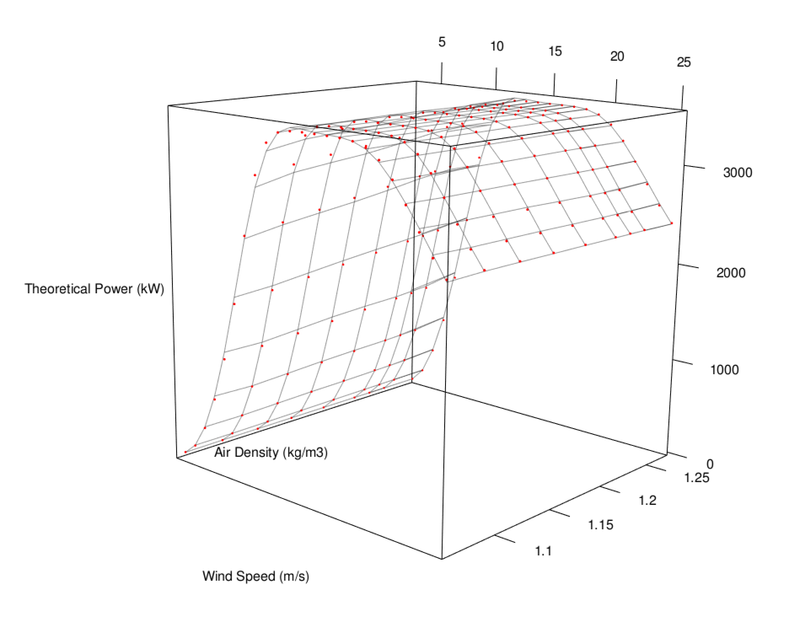

```{r setup, include=FALSE}
knitr::opts_chunk$set(echo = TRUE)
```

## Overview of the method

This script provides creating a three dimensional dynamical wind turbine power curve model based on the power curve of the manufacturer by using air density and wind speed together to get active power. Besides, it also has IEC correction functions which should be applied to the raw wind speed data of the nacelle mounted anemometer (wind turbine).

First, read the turbine based data. Should have wind speed, standart deviation of wind speed, power, temperature, air pressure, relative humidity (if any).

```{r}
wtg = read.csv("windfarm_raw.csv",header = T, stringsAsFactors = F)

# Have a look to the summary of the data.
summary(wtg)
```

Since wind turbine data doesn't have air density variable. It has to be calculated and here a function has been defined. This function uses temperature, pressure and relative humidity to calculate air density. However; if you don't bring relative humidity then, dry air density will be calculated. Make sure to use Celcius units for Temperature, hPa or mb units for air Pressure and % for relative humidity.

```{r}
air_dens_calc = function(temp,press,rh) {
  
  if (missing(rh)) {

      warning("You didn't specify relative humidity, so dry air density is calculated.",call. = F)
      rho = (press*100)/(287.058*(temp+273.15))
      return(rho)
      
    } else {
    
      warning("Moist air density is calculated!",call. = F)
      p1 = 6.1078 * 10^(7.5*temp/(temp+237.3))
      pv = p1*rh
      pd = press*100 - pv
      rho = (pd/(287.058*(temp+273.15)))+(pv/(461.495*(temp+273.15)))
      return(rho)
      
  }
}
  ```

In case of having dew point temperature variable and not having relative humidity, here a function has also been defined for getting relative humidity by using temperature and dew point temperature data. Note that; units for these variable are celcius.

```{r}
rh_calc = function(t,td) {
  
  100*(exp((17.625*td)/(243.04+td))/exp((17.625*t)/(243.04+t)))

}
```

Now let's calculate the air density column and add it as a variable to the wtg dataframe.


```{r}
wtg$AirDensity = air_dens_calc(press = wtg$Pressure,temp = wtg$Temperature, rh = wtg$Relh)
```

Now make some IEC adjustments to the raw wind speed data from nacelle mounted anemometer of wind turbine. First function which is iec_ad makes air density correction to the wind speed data by using wind speed and air density. Second function which is iec_turb makes turbulence correction to the wind speed data by using wind speed and standart deviation of the record. Third function combines two IEC correction functions.

```{r}
#IEC air density correction function
iec_ad = function(ws,rho) {
  ws_norm=ws*(rho/1.225)^(1/3)
  return(ws_norm)  
}

# IEC turbulence correction function
iec_turb = function(ws, ws_std) {
  ws_corr = ws*(1+3*(ws_std/ws)^2)^(1/3)
  return(ws_corr)
}

# IEC corrections which have to be applied to the raw wind turbine wind speed data.
iec_corr = function(ws,ws_std,rho) {
  ws_norm=ws*(rho/1.225)^(1/3)
  ws_corr = ws_norm*(1+3*(ws_std/ws)^2)^(1/3)
  return(ws_corr)
}
```

Let's create a column for adjusted wind speed based on IEC criteria by using our new defined iec_corr function.

```{r}
wtg$WindSpeed_IEC=iec_corr(ws = wtg$WindSpeed,ws_std = wtg$WindSpeed_Std, rho = wtg$AirDensity)
# Have a look to the summary of the data.
summary(wtg)
```

Things are getting hot! Load those required libraries.

```{r, message=F}
library(dplyr)
library(tidyr)
library(ggplot2)
library(lubridate)
```

Change class of date column to POSIXct from character with lubridate package.

```{r}
wtg$Date = ymd_hms(wtg$Date)
```

Our wtg data had all wind farm data and has a column with the name Device. Let's filter only WTG01 and select only required columns from our wtg dataframe. Besides, command below plots first week of the month with Date on x axis, and WindSpeed and WindSpeed_IEC on Y axis in a line plot.

```{r}
wtg %>% filter(Device == "WTG01") %>% select(Date,WindSpeed,WindSpeed_IEC) %>% 
  gather(key = "Label", value = "WindSpeed", -Date) %>% filter((ceiling(day(Date)/7)==1)) %>%
  ggplot(.,aes(x=Date, y=WindSpeed, color = Label)) + geom_line() +
  scale_color_discrete(name = "Label",labels = c("Raw Wind Speed","Adjusted Wind Speed (IEC)"))
```

Let's read the theoretical power curve data sheet of the manufacturer. It has theoretical powers for different air densities and wind speeds.

```{r}
g132 = read.csv("g132_powercurve.csv",header = T)
colnames(g132)[1] = "WindSpeed"
summary(g132)
```

Since we have all the variables (wind speed and air density) to build a power curve model of the related wind turbine, we have to create a perfectly overfit transfer function. Before creating a 3-dimensional model, let's proceed with the 2 dimensional loess function for wind speed and power by considering a constant air density 1.225 kg/m3.

```{r warning=F, message=F}
g132 %>% select(WindSpeed,ad_1225) %>% ggplot(.,aes(x=WindSpeed,y=ad_1225)) +
  geom_point() + stat_smooth(method = "loess",span=0.1, lwd = 0.7,aes(color = "0.1"),se = F) +
  stat_smooth(method = "loess", span = 0.2, aes(color="0.2"), se = F)+ 
  stat_smooth(method = "loess", span = 0.5, aes(color="0.5"), se = F, lwd = 0.7)+
  stat_smooth(method = "loess", span = 0.7, aes(color="0.7"), se = F)+
  scale_colour_manual(name="Spans", values=c("royalblue", "darkred","purple4","orange")) +
  ggtitle("Loess - Span Deciding")
```

It seems that smaller spans provide us a better overfit. Now, lets gather our manufacturer powercurve data.

```{r}
g132_gathered = g132 %>% gather(key = "AirDensity",value = "Power",-WindSpeed)
summary(g132_gathered)
```

After gathering it, all air density column names are now elements of AirDensity column and these all elements have some numerical part within it. For instance, ad_106, ad_112. They represent the air density for 1.06 and 1.12 kg/m3 Now let's convert them into numerical values before creating a model which uses wind speed and also air density as input.

```{r}
library(readr)
g132_gathered$AirDensity = parse_number(g132_gathered$AirDensity)

# After extracting the numerical part from the strings now it has to be editted before using as input to the model.
g132_gathered[2]=lapply(g132_gathered[2], function(x) {ifelse(x>1000,x/1000,x/100)})

# Arrange data (sort from low to high air density).
g132_gathered = g132_gathered %>% arrange(AirDensity,WindSpeed)
summary(g132_gathered)
```

AirDensity column converted to numerical values since we are planning to create a 3 dimensional model and it requires numerical values.

Now lets load the rgl library and plot all the power curves which have been taken from the manufacturer discretely. Here, x, y and z axis represents windspeed, air density and power respectively.

```{r}
library(rgl)
plot3d(x = g132_gathered$WindSpeed, 
       y = g132_gathered$AirDensity, 
       z = g132_gathered$Power,
       xlab = "Wind Speed (m/s)",
       ylab = "Air Density (kg/m3)",
       zlab = "Theoretical Power (kW)",
       type = "s", # s for spheres 
       size=0.75, # sizes of the spheres
       lit=FALSE, # lighting calculations are not being done
       col="red")
```


It seems we have perfectly plotted the points three dimensionally and we have also decided to use overfitted LOESS models for every power curves for each air density. However, we are in need of a model which uses wind speed and air density at the same time in order to get power. In other words, we have to create a surface to this 3d scatter plot.

Since wind power is calculated by using the equation;

$$Power = \frac{1}{2}.\rho.A.V^3.C_p $$
While $\rho$ represents the air density; A, V and Cp represent swept area of the wind turbine, wind speed and power coefficient respectively. Due to having this equation; we know the background information for creating a 3 dimensional function. Since we use only two variables (air density and wind speed) to create 3d function for power curve, we are going to implement the relationship between them to the loess which is $\rho.V^3$. 

On the other hand; control parameters of the loess model has crucial importance for building a desired model. Therefore, degree, span, surface and statistics arguments are wisely chosen. 

```{r}
loess_surf = loess(Power ~ AirDensity*WindSpeed^3, 
                   data = g132_gathered, 
                   degree = 2, # degree of the polynomial
                   span = 0.11595, # degree of smoothing
                   surface = "direct", # fitted surface is computed directly instead by interpolation
                   statistics = "exact" # statistics is computeed exactly instead approximately)
)
```

After fitting a 3 dimensional model Now let's create a marigin datatable for making predictions over it. Because we would like to check whether our predicted surface overfit the exact points (power curve from the manufactureres data sheet), marigin created by considering the resolution of both the wind speed and air density variables given in this datasheet. 

```{r}
marigin = list(WindSpeed = seq(from = min(g132_gathered$WindSpeed), 
                               to = max(g132_gathered$WindSpeed),by = 1), 
               AirDensity = c(seq(from = min(g132_gathered$AirDensity), 
                                  to = max(g132_gathered$AirDensity),by = 0.03),
                              1.225))
```

Let's make predictions by using the marigin data (expanded version of the data)

```{r}
loess_pred = predict(loess_surf,newdata = expand.grid(marigin), se = T)
```

Now let's plot the scatter plot of original data and a surface on it by using predicted data for checking the goodness of fit visually.

```{r}
library(rgl)
plot3d(x = g132_gathered$WindSpeed, 
       y = g132_gathered$AirDensity, 
       z = g132_gathered$Power,
       xlab = "Wind Speed (m/s)",
       ylab = "Air Density (kg/m3)",
       zlab = "Theoretical Power (kW)",
       type = "s", # s for spheres 
       size=0.2, # sizes of the spheres
       lit=FALSE, # lighting calculations are not being done
       col="red")

surface3d(marigin[[1]], marigin[[2]], loess_pred[[1]], alpha=0.4, front="lines", back="lines")

```



It's ready to use loess_surf model for creating realistic predictions. Let's make a prediction for 10 m/s wind speed and 1.06 kg/m3 air density.

```{r}
predict(loess_surf, data.frame(WindSpeed = c(5,11), AirDensity = 1.225))
```

\raggedleft
**Created by Cem Özen**
