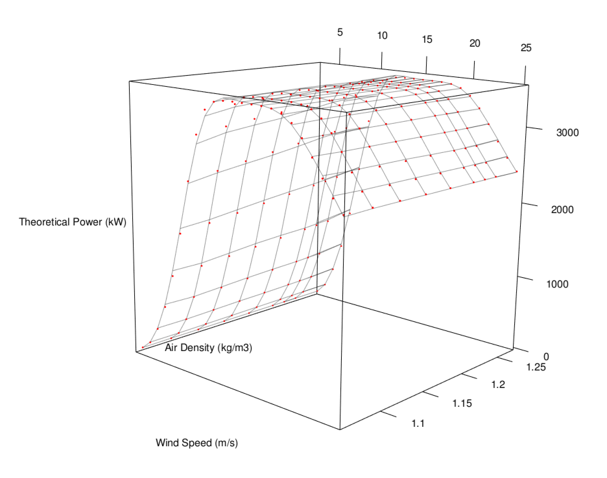

# R - Dynamical Multivariate Wind Turbine Power Curve Model and IEC Corrections

This repository discusses creating a three-dimensional dynamical wind turbine power curve model based on the power curve data sheets of the wind turbine manufacturer by using the air density and wind speed together to get active power. Besides, it also has IEC correction functions which should be applied to the raw wind speed data of the nacelle mounted anemometer (wind turbine).

R Markdown, word and pdf files for the general overview are pushed to the GitHub.

