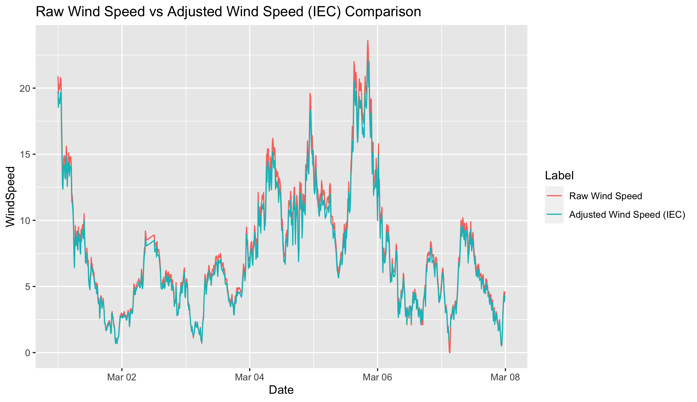
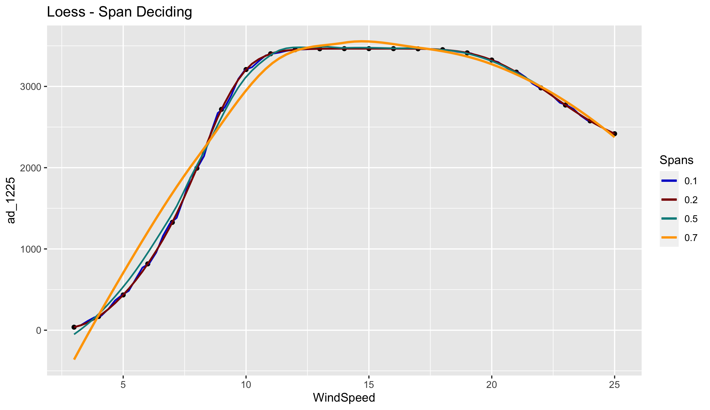
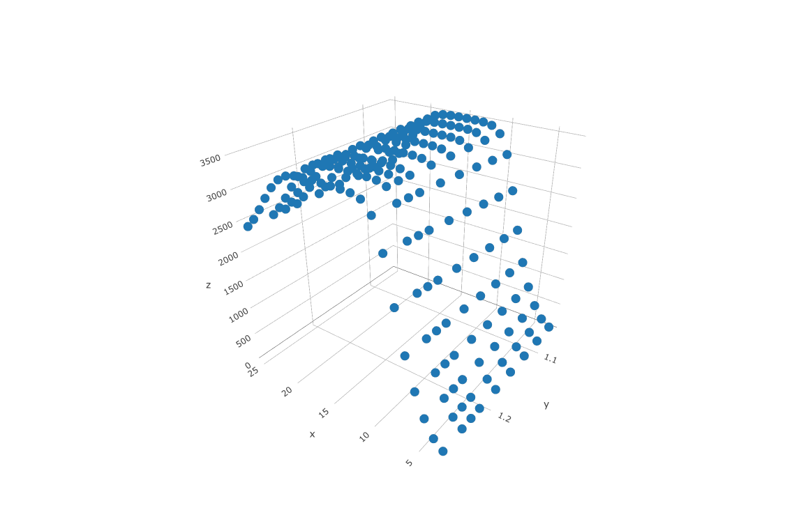
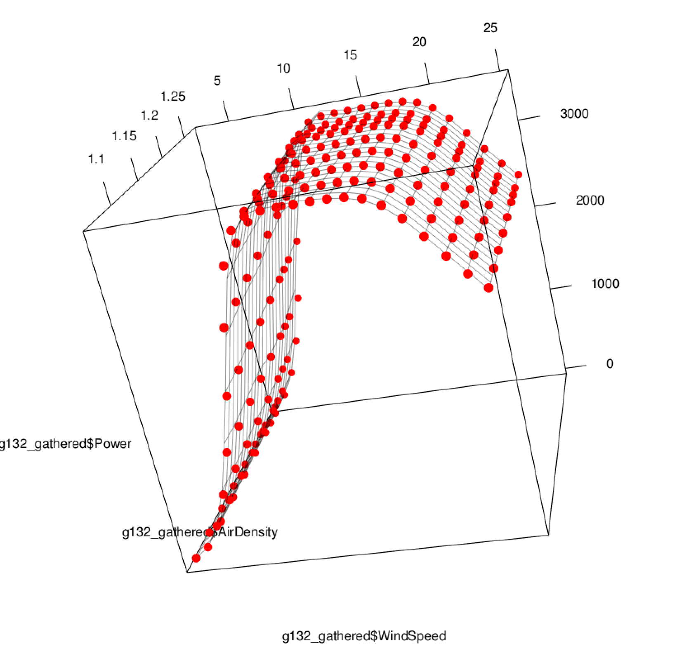

# R - Dynamical Multivariate Wind Turbine Power Curve Model and IEC Corrections

This script provides creating a three dimensional dynamical wind turbine power curve model based on the power curve of the manufacturer by using air density and wind speed together to get active power. Besides, it also has IEC correction functions which should be applied to the raw wind speed data of the nacelle mounted anemometer (wind turbine).

First, read the turbine based data. Should have wind speed, standart deviation of wind speed, power, temperature, air pressure, relative humidity (if any).

```R
wtg = read.csv("windfarm_raw.csv",header = T, stringsAsFactors = F)
```

Since wind turbine data doesn't have air density variable. It has to be calculated and here a function has been defined. This function uses temperature, pressure and relative humidity to calculate air density. However; if you don't bring relative humidity then, dry air density will be calculated. Make sure to use Celcius units for Temperature, hPa or mb units for air pressure and % for relative humidity.

```R
air_dens_calc = function(temp,press,rh) {

  if (missing(rh)) {

      warning("You didn't specify relative humidity, so dry air density is calculated.",call. = F)
      rho = (press*100)/(287.058*(temp+273.15))
      return(rho)

    } else {

      warning("Moist air density is calculated!",call. = F)
      p1 = 6.1078 * 10^(7.5*temp/((temp+273.15)+237.3))
      pv = p1*rh
      pd = press*100 - pv
      rho = (pd/(287.058*(temp+273.15)))+(pv/(461.495*(temp+273.15)))
      return(rho)

  }
}
```

In case of having dew point temperature variable and not havinf relative humidity, here a function has also been defined for getting relative humidity by using temperature and dew point temperature data. Note that; units for these variable are celcius.

```R
rh_calc = function(t,td) {
  
  100*(exp((17.625*td)/(243.04+td))/exp((17.625*t)/(243.04+t)))

}
```

Creating air density column.
```R
wtg$AirDensity = air_dens_calc(press = wtg$Pressure,temp = wtg$Temperature, rh = wtg$Relh)
```

Now make some IEC adjustments to the raw wind speed data from nacelle mounted anemometer of wind turbine. First function which is iec_ad makes air density correction to the wind speed data by using wind speed and air density. 

Second function which is iec_turb makes turbulence correction to the wind speed data by using wind speed and standart deviation of the record. 

Third function combines two IEC correction functions.

* IEC air density correction function:
```R
iec_ad = function(ws,rho) {
  
  ws_norm=ws*(rho/1.225)^1/3
  return(ws_norm)
}
```

* IEC turbulence correction function:
```R
iec_turb = function(ws, ws_std) {
  
  ws_corr = ws*(1+3*(ws_std/ws)^2)^1/3
  return(ws_corr)
  
}
```

* IEC corrections which have to be applied to the raw wind turbine wind speed data.
```R
iec_corr = function(ws,ws_std,rho) {
  ws_norm=ws*(rho/1.225)^(1/3)
  ws_corr = ws_norm*(1+3*(ws_std/ws)^2)^(1/3)
  return(ws_corr)
}
```

Let's create a column for adjusted wind speed based on IEC criteria by using our new defined iec_corr function.
```R
wtg$WindSpeed_IEC=iec_corr(ws = wtg$WindSpeed,ws_std = wtg$WindSpeed_Std, rho = wtg$AirDensity)
```

Have a look to the summary of the data.
```R
summary(wtg)
```
```
    Device              Date             WindSpeed     WindSpeed_Std        Power         Temperature    
 Length:8832        Length:8832        Min.   : 0.00   Min.   :0.0000   Min.   : -27.0   Min.   :-9.300  
 Class :character   Class :character   1st Qu.: 4.20   1st Qu.:0.3000   1st Qu.: 122.9   1st Qu.: 5.000  
 Mode  :character   Mode  :character   Median : 6.70   Median :0.5000   Median : 760.5   Median : 8.500  
                                       Mean   : 7.78   Mean   :0.5838   Mean   :1209.9   Mean   : 7.893  
                                       3rd Qu.:10.60   3rd Qu.:0.7000   3rd Qu.:2427.7   3rd Qu.:12.100  
                                       Max.   :28.10   Max.   :5.0000   Max.   :3514.1   Max.   :19.500  
                                                                                                         
      Relh           Pressure       AirDensity     WindSpeed_IEC    
 Min.   : 37.68   Min.   :813.5   Min.   :0.9806   Min.   : 0.2213  
 1st Qu.: 56.31   1st Qu.:819.4   1st Qu.:1.0020   1st Qu.: 4.0541  
 Median : 65.38   Median :820.9   Median :1.0128   Median : 6.2983  
 Mean   : 66.82   Mean   :820.6   Mean   :1.0151   Mean   : 7.3892  
 3rd Qu.: 74.19   3rd Qu.:822.4   3rd Qu.:1.0237   3rd Qu.:10.0655  
 Max.   :100.00   Max.   :825.5   Max.   :1.0718   Max.   :27.0861  
                                                   NA's   :18       

```

Things are getting hot! Load those required libraries.
```R
library(dplyr)
library(tidyr)
library(ggplot2)
library(lubridate)
```

Change class of date column to POSIXct from character with lubridate package.
```R
wtg$Date = ymd_hms(wtg$Date)
```

Our wtg data had all wind farm data and has a column with the name Device. Let's filter only WTG01 and select only required columns from our wtg dataframe. Besides, command below plots first week of the month with Date on x axis, and WindSpeed and WindSpeed_IEC on Y axis in a line plot.
```R
wtg %>% filter(Device == "WTG01") %>% select(Date,WindSpeed,WindSpeed_IEC) %>% 
  gather(key = "Label", value = "WindSpeed", -Date) %>% filter((ceiling(day(Date)/7)==1)) %>%
  ggplot(.,aes(x=Date, y=WindSpeed, color = Label)) + geom_line() +
  scale_color_discrete(name = "Label",labels = c("Raw Wind Speed","Adjusted Wind Speed (IEC)")) +
  ggtitle("Raw Wind Speed vd Adjusted Wind Speed Comparison")
```


Reading Power Curve Data From Manufacturer. It has WindSpeed and Powers for different air densities on seperate columns.
```R
g132 = read.table("g132_powercurve.csv",sep = ";",header = T)
colnames(g132)[1] = "WindSpeed"
```

Let's have a look to create a perfectly overfit model to the manufacturers power curve
```R
g132 %>% select(WindSpeed,ad_1225) %>% ggplot(.,aes(x=WindSpeed,y=ad_1225)) +
  geom_point() + stat_smooth(method = "loess",span=0.1, lwd = 0.7,aes(color = "0.1"),se = F) +
  stat_smooth(method = "loess", span = 0.2, aes(color="0.2"), se = F)+ 
  stat_smooth(method = "loess", span = 0.5, aes(color="0.5"), se = F, lwd = 0.7)+
  stat_smooth(method = "loess", span = 0.7, aes(color="0.7"), se = F)+
  scale_colour_manual(name="Spans", values=c("royalblue", "darkred","purple4","orange")) +
  ggtitle("Loess - Span Deciding")
```


It seems that smaller spans provide us a better overfit. Now, lets gather our manufacturer powercurve data.
```R
g132_gathered = g132 %>% gather(key = "AirDensity",value = "Power",-WindSpeed)
```

After gathering it, all air density column names are now elements of AirDensity column and these all elements have some numerical part within it. For instance, ad_106, ad_112. They represent the air density for 1.06 and 1.12 kg/m3. 

Now let's convert them into numerical values before creating a model which uses wind speed and also air density as input.
```R
library(readr)
g132_gathered$AirDensity = parse_number(g132_gathered$AirDensity)
```

After extracting the numerical part from the strings now it has to be editted before using as input to the model.
```R
g132_gathered[2]=lapply(g132_gathered[2], function(x) {ifelse(x>1000,x/1000,x/100)})
```

Arrange data (sort from low to high air density).
```R
g132_gathered = g132_gathered %>% arrange(AirDensity,WindSpeed)
```

Now lets plot all the power curves which have been taken from the manufacturer discretely with the help of plotly. Here, x axis windspeed, y axis air density and z axis power.
```R
library(plotly)
plot_ly(x=g132_gathered$WindSpeed,y=g132_gathered$AirDensity,z=g132_gathered$Power)
```


It seems we have perfectly plotted the points three dimensionally and we have also decided to use overfitted LOESS models for every power curves for each air density. However, we are in need of a multivariate model which uses wind speed and air density at the same time in order to get power. In other words, we have to create a surface to this 3d scatter plot.
```R
loess_surf = loess(Power ~ WindSpeed*AirDensity, data = g132_gathered, degree = 2, span = 0.1)
```

Now let's create a marigin datatable for making predictions over it. 
```R
marigin = list(WindSpeed = seq(from = min(g132_gathered$WindSpeed), to = max(g132_gathered$WindSpeed),by = 1), 
               AirDensity = seq(from = min(g132_gathered$AirDensity), to = max(g132_gathered$AirDensity),by = 0.01))
```

Let's make predictions by usingz marigin data (expanded version of the data)
```R
loess_pred = predict(loess_surf,newdata = expand.grid(marigin), se = T)
```

Now let's plot the scatter plot of original data and a surface on it by using predicted data. rgl package has been used for 3 dimensional plot.
```R
library(rgl)
plot3d(g132_gathered$WindSpeed, g132_gathered$AirDensity, g132_gathered$Power, type="s", size=0.75, lit=FALSE, col="red")
surface3d(marigin[[1]], marigin[[2]], loess_pred[[1]], alpha=0.4, front="lines", back="lines")
```



It's ready to use loess_surf model for creating realistic predictions. Let's make a prediction for 5 and 11 m/s wind speed and 1.225 kg/m3 air density.
```R
predict(loess_surf, data.frame(WindSpeed = c(5,11), AirDensity = 1.225))
```
```
[1]  429.2308 3405.1458
```
